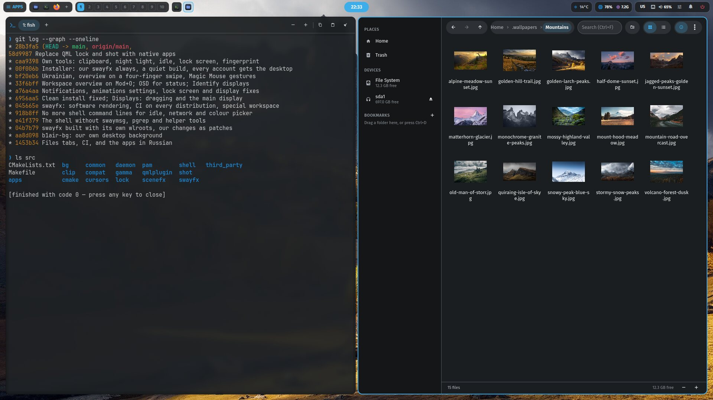
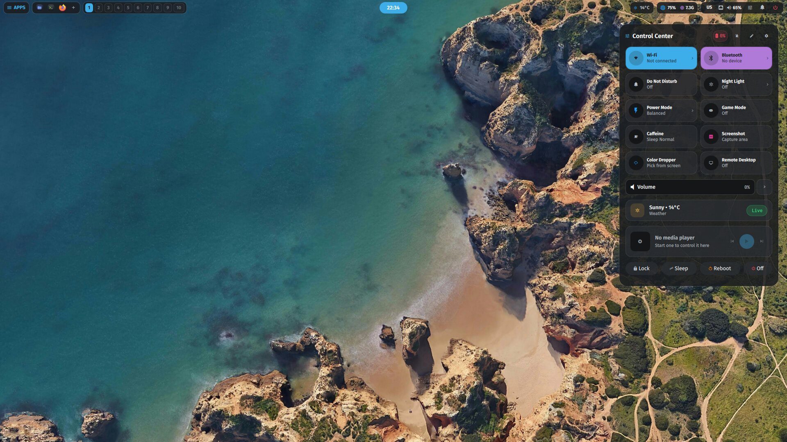
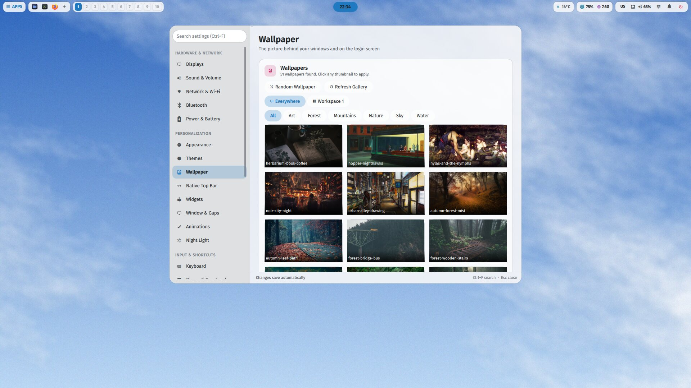
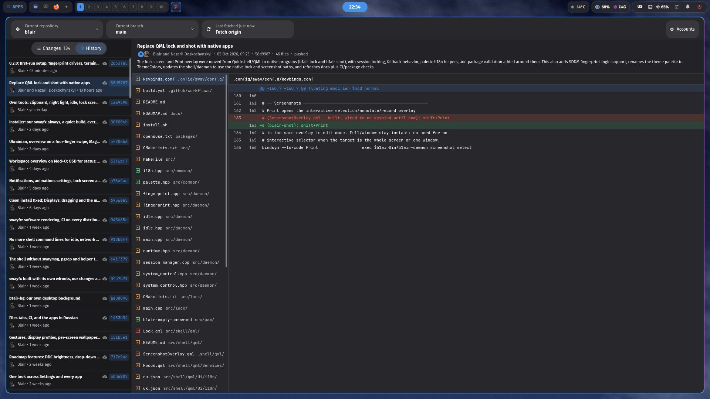

# b1air Desktop Environment

<div align="center">



**A keyboard-driven Wayland desktop for Linux — Arch, Debian/Ubuntu, Fedora and openSUSE.**  
*Built with SwayFX, Qt6/QML and a native C++20 core daemon, in Breeze and Adwaita colours.*

[](https://archlinux.org)
[](https://debian.org)
[](https://fedoraproject.org)
[](https://www.opensuse.org)
[](https://github.com/WillPower3309/swayfx)
[](https://qt.io)
[](https://isocpp.org)
[](#themes-and-wallpapers)
[](LICENSE)

</div>

---

## Overview

b1air is a unified desktop setup for Linux designed around keyboard efficiency, low latency, and one theme across every application — dark or light.

Key components:
* **Compositor**: SwayFX with hardware-accelerated rounded corners, soft shadows, and selective blur. The theme picked in Settings colours everything from one palette: the shell and the native apps (`Ui/Design.qml`), window borders, GTK and Qt/Kvantum applications, the terminal, the lock screen and the login screen.
* **Core Daemon (`b1air-daemon`)**: A single compiled C++20 binary that manages window autotiling, focus tracking (SQLite3), audio and microphone controls (PipeWire via `wpctl`), PAM user profiles, and power management without shell script overhead.
* **Desktop Shell**: Lightweight Qt6/QML overlays providing an application launcher, clipboard history, control center, emoji picker, and a visual Alt+Tab window switcher.
* **First-run setup**: at the first login, Settings walks through language and keyboard, Wi-Fi, theme, wallpaper, the account and its fingerprint. After an update it shows only the steps that are new, and a step only when the machine has the hardware for it (no reader, no fingerprint step).
* **Own small tools** in place of the usual helpers, each with its tests: `b1air-lock` (the lock screen, instead of swaylock), idle handling inside the daemon (instead of swayidle), `b1air-clip` (instead of wl-clipboard), `b1air-gamma` (night light with a schedule, instead of wlsunset), `b1air-bg` (wallpaper, instead of swaybg), `b1air-shot` (the Print overlay: region, recording, QR — instead of a QML one started per press).
* **Lock screen**: `b1air-lock` by default — up in milliseconds, before the machine sleeps: each screen's wallpaper blurred, clock, account picture and name, one password field for every screen, keyboard layout, battery, weather, and a reboot / sleep / shut down menu. It is the only lock screen — no QML; one that dies while locked is replaced by a new one, the session staying locked.
* **Fingerprint** (fprintd): the installer finds the reader by its USB id and installs the driver libfprint lacks — python-validity for the Validity/Synaptics readers of many ThinkPads (`06cb:009a`), the Goodix builds for others (Arch; `lib/fingerprint.sh`); updates add it when a reader appears. Enrol and test fingers in Settings → Lock & Login; a touch opens either lock screen. Optionally at the login screen too (an empty password and Enter, then the reader) — only SDDM's PAM file is changed; sudo, polkit and the console keep asking for the password.
* **Remote Access**: Built-in headless WayVNC support and unattended screencasting configuration for AnyDesk, RustDesk, and OBS with persistent uinput permissions.

---

## Screenshots

| | |
| :---: | :---: |
|  |  |
| Control Center — Breeze Dark | Settings → Wallpaper — Breeze Light |
|  |  |
| Git — Adwaita Dark | Terminal and Files — Breeze Dark |

### Themes and wallpapers

Four built-in themes, after the two big desktops: **Breeze Dark** (the
default) and **Breeze Light** from KDE, **Adwaita Dark** and **Adwaita Light**
from GNOME — chosen for text, dim text and borders that are clearly apart
rather than a few shades of one tint. A theme can also be made from the
wallpaper, created, edited and shared as a file (Settings → Appearance).

The wallpapers are sorted into folders — Art, Forest, Mountains, Nature, Sky,
Water — which Settings → Wallpaper offers as categories; a folder of your own
in `~/.wallpapers` becomes one too. A first login starts on the daytime
clouds (`Sky/clouds-day.jpg`).

---

## Architecture

### Spotlight Launcher (`Super + Space`)
Fuzzy application search, clipboard history, and inline math calculations in a single centered overlay.

### Settings & Control Center (`Super + Shift + S` / `Super + C`)
Graphical desktop configuration:
* Wallpaper selection by category, per screen or per workspace, and a theme built from the wallpaper (Appearance → From the wallpaper).
* Audio sink selector and per-stream volume controls.
* Focus time and screen usage analytics stored in SQLite.
* Toggles for Night Light, Game Mode (disables blur and pins performance governor), and Remote Desktop.

### SDDM Greeter
Takes the desktop's live palette (written by `b1air-daemon` to `/var/cache/wallpaper`), with digital clock, user avatar synchronization, session selection, virtual keyboard support, and fingerprint login when it is turned on in Settings → Lock & Login.

---

## Installation

### Supported distributions

| Family | Versions | Quickshell | Compositor |
| :--- | :--- | :--- | :--- |
| **Arch** (EndeavourOS, Manjaro, CachyOS, …) | rolling | official repo | swayFX built from source |
| **Debian / Ubuntu** (Mint, Pop!_OS, …) | Debian 13+, Ubuntu 25.04+ | built from source | swayFX built from source |
| **Fedora** (Nobara, …) | 40+ | COPR `errornointernet/quickshell`, else source | swayFX built from source |
| **openSUSE** *(experimental)* | Tumbleweed / Slowroll | repo if present, else source | swayFX built from source |

There is one compositor: ours. A sway or swayfx package already installed
(the distribution's or the AUR's) is removed once ours is built, so the login
screen does not offer two Sway sessions — `B1AIR_SWAYFX_FROM_SOURCE=0` takes
the packaged swayFX instead (the AUR's on Arch), `B1AIR_KEEP_DISTRO_SWAY=1`
keeps a packaged one beside ours. Should the build fail, plain sway is
installed so there is a desktop, and the next install.sh run tries again.
`tools/check-packages.sh`, run in CI for every family, checks that every name
in `packages/` exists in that family's repositories.

Where swayFX is built from source (`tools/build-swayfx.sh`), it is built the
way the sway fork scroll ships: swayFX 0.6 with its own copies of wlroots
0.20.2 and scenefx 0.5 in its `subprojects/`, installed to `/usr/local` with
the two libraries in a private `/usr/local/lib/b1air-swayfx`. Whatever wlroots
the distribution has (Ubuntu 26.04: 0.19) is not used and not touched. The
versions are pinned in the script and move together; wlroots is fetched from
gitlab.freedesktop.org at install time. Our own changes are patch series on
top (`src/swayfx/`), among them a fallback that lets swayFX start without a
GPU, on a software renderer without effects, rather than not start at all.

The family is detected from `/etc/os-release`; derivatives are matched through
`ID_LIKE`, and `--distro arch|debian|fedora|opensuse` overrides it. The desktop
needs **Qt 6.6 or newer**, which is why Debian 12 and Ubuntu 24.04 (Qt 6.4) are
not supported — the installer checks this before installing anything.

On plain sway (no swayFX) there is no blur, no rounded corners and no shadows;
the installer comments those swayFX-only lines out of your deployed
`~/.config/sway/conf.d`, so sway starts without config errors. Everything else
works the same.

Package lists live in [`packages/`](packages) — one file per family, `?name`
marks a package that may not exist on every release and is skipped if absent.

Remote access is disabled and bound to localhost by default. For the background
VM preview workflow only, explicitly start the session with `B1AIR_DEV_MODE=1`;
this enables LAN binding and development-only prompt-free screencasting.

### Option 1: One-Line Installer

The bootstrap script refuses to run an unpinned checkout, so pass the commit
you have reviewed:

```bash
DOTFILES_COMMIT=<40-character commit hash> \
  bash <(curl -fsSL https://raw.githubusercontent.com/bla1r1/DotsFiles/main/bootstrap.sh)
```

### Option 2: Manual Clone

```bash
git clone https://github.com/bla1r1/DotsFiles.git ~/DotsFiles
cd ~/DotsFiles
./install.sh
```

For an interactive menu:

```bash
./install-ui.sh
```

#### Flags
```bash
# Deploy dotfiles and compile C++ tools without reinstalling packages
./install.sh --skip-packages

# Arch: no AUR (plain sway). Others: no downloads from upstream releases
# (JetBrainsMono Nerd Font, starship, eza)
./install.sh --no-aur

# Force the distribution family when detection gets it wrong
./install.sh --distro debian

# Preview actions without changing the system
./install.sh --dry-run
```

Environment variables: `QUICKSHELL_REF` (tag built from source, default
`v0.3.1`), `B1AIR_QUICKSHELL_FROM_SOURCE=1` (build Quickshell even where a
package exists), `B1AIR_SWAYFX_FROM_SOURCE=1` (build swayFX with its own
wlroots even where a package exists), `SWAYFX_REF` / `SCENEFX_REF` /
`WLROOTS_REF` and the matching `*_REPO` (other versions or mirrors for that
build), `B1AIR_SKIP_QT_CHECK=1` (skip the Qt version check).

An interrupted install resumes where it stopped; `--restart` starts over.

#### Other accounts

Install once, as one user; every account on the machine can then pick the
b1air session at the login screen. The defaults go to `/usr/share/b1air`
(configuration, wallpapers, cursors), and the session copies them into an
account at its first login — nothing it already has is overwritten. After
an update, the shipped files are brought up to date at the next login (the
replaced ones are kept in `~/.dotfiles-backup-<date>`); what was chosen in
Settings is left alone.

What only root can give another account — the `input` group (Magic Mouse
gestures, remote control), the `power` group (battery charge limit) and fish
as its shell:

```bash
./install.sh --add-user anna
```

---

## Keybindings

| Shortcut | Action | Target |
| :--- | :--- | :--- |
| `Super + T` | Open Terminal | b1air-term |
| `Super + Space` | Application Grid | Launchpad |
| `Super + K` / `Super + /` | Application Launcher | Spotlight |
| `Super + E` | File Manager | b1air-files |
| `Super + I` | Code Editor | Zed |
| `Super + X` | Text Editor | b1air-text |
| `Ctrl + Shift + Esc` | System Monitor | b1air-monitor |
| `Super + Ctrl + C` | Camera | b1air-camera |
| `Super + Shift + S` | Settings Hub | Settings App |
| `Super + C` | Control Center | Quick Toggles |
| `Super + V` | Clipboard History | Clipboard Manager |
| `Super + .` | Emoji Picker | Emoji Popup |
| `Alt + Tab` | Window Switcher | Visual Switcher |
| `Super + Shift + C` | Color Picker | Screen Eyedropper |
| `Super + Shift + T` | Screen Time Analytics | FocusTime |
| `Super + Shift + G` | Toggle Game Mode | b1air-daemon |
| `Super + Q` | Close Window | Sway |
| `Super + Ctrl + Space` | Toggle Floating | Sway |
| `Super + -` / `Super + Shift + -` | Minimize / Restore Window | b1air-daemon |
| `Print` | Region Screenshot | grim + slurp |
| `Super + Print` | Full Screen Screenshot | b1air-daemon |
| `Super + Shift + Print` | Focused Window Screenshot | b1air-daemon |
| `Ctrl + Alt + L` | Lock Screen | Lockscreen |
| `Super + Shift + E` | Session Menu | Power Menu |

---

## CLI Reference: `b1air-daemon`

`b1air-daemon` provides direct command-line access to desktop subsystems:

```bash
# Screen time statistics
b1air-daemon stats                 # Show today's app usage summary
b1air-daemon stats 2026-08-26      # Query specific date

# Hardware controls
b1air-daemon volume up 5           # Volume +5% (wpctl / PipeWire)
b1air-daemon volume down 5         # Volume -5%
b1air-daemon volume mute           # Toggle audio mute
b1air-daemon mic toggle            # Toggle microphone mute
b1air-daemon brightness up 5       # Screen brightness +5%
b1air-daemon color-picker          # Eyedropper hex to clipboard

# Remote Desktop & Screencast
b1air-secret-service set vnc-password  # Set encrypted WayVNC password (stdin recommended)
b1air-daemon remote start-stdin 5900  # Start authenticated TLS WayVNC; password via stdin
b1air-daemon remote stop           # Stop WayVNC
b1air-daemon remote status         # JSON status of remote service
b1air-daemon remote prompt-free on # Enable unattended screencasting

# Session Management
b1air-daemon lock                  # Lock screen immediately (b1air-lock); --wait blocks until opened
b1air-daemon fingerprint status    # The reader and the saved fingers (JSON)
b1air-daemon fingerprint login on  # Fingerprint at the login screen (as root: edits /etc/pam.d/sddm only)
b1air-daemon game-mode toggle      # Switch between power-save and low-latency mode
```

---

## Repository Structure

```text
DotsFiles/
├── .config/                   # User configurations (SwayFX, Fish, Kvantum, GTK/Qt, portals)
│   ├── fish/                  # Fish shell: prompt, aliases, greeting
│   ├── sway/                  # SwayFX compositor keybinds, rules, look & feel
│   ├── systemd/               # Systemd user services for the b1air session
│   └── xdg-desktop-portal-wlr # Unattended screencast configuration
├── .local/share/icons/        # The b1air cursor theme (built from src/cursors)
├── .wallpapers/<Category>/    # Wallpapers offered in Settings, a folder per category
├── src/                       # Compiled C++20 desktop suite & Qt6 shell
│   ├── CMakeLists.txt         # One build for the whole suite, into src/build
│   ├── Makefile               # `make` builds, `make install` installs
│   ├── cmake/B1airApp.cmake   # b1air_add_app(): how every app is built
│   ├── daemon/                # b1air-core library; b1air-daemon, polkit agent, secret service
│   ├── shell/                 # b1air-shell: Qt6/QML desktop (TopBar, launcher, popups, Settings)
│   ├── apps/<app>/            # One program each: sources, <App>Window.qml, .desktop, icon
│   │                          #   camera files git monitor settings term text view
│   ├── common/                # Headers shared by several programs (QML search path)
│   ├── qmlplugin/             # B1air.Daemon QML module
│   ├── bg/                    # b1air-bg: the wallpaper, per screen and per workspace
│   ├── clip/                  # b1air-clip: copy, paste and watch the clipboard (no wl-clipboard)
│   ├── gamma/                 # b1air-gamma: night light, fixed or by hours or sunset/sunrise
│   ├── lock/                  # b1air-lock: the lock screen (no swaylock)
│   ├── shot/                  # b1air-shot: the Print overlay — region, record, QR
│   ├── pam/                   # Fingerprint PAM file for the lock screens; the login screen's helper
│   ├── compat/                # Quickshell stand-in that lets b1air-settings run on its own
│   ├── cursors/               # Sources of the b1air cursor theme
│   └── third_party/           # Vendored SQLite, nlohmann/json, libvterm
├── usr/                       # System session files
│   ├── bin/b1air-session      # Wayland session launch wrapper
│   └── share/                 # SDDM greeter, wayland-sessions, and portal configs
├── etc/                       # System-wide configurations (SDDM, udev rules, tiny-dfr)
├── lib/                       # Shared by the scripts: distro.sh (distribution, packages),
│                              #   fingerprint.sh (reader drivers), wallpapers.sh
├── packages/                  # Package lists per distribution family
├── tools/                     # Development utilities (smoke tests, controller)
├── docs/                      # ROADMAP.md (milestones), screenshots/
├── bootstrap.sh               # One-line remote installer
├── install.sh                 # Installation engine (Arch, Debian/Ubuntu, Fedora, openSUSE)
├── install-ui.sh              # Interactive Whiptail TUI installer
├── update-dotfiles.sh         # Environment updater & config sync manager
├── LICENSE                    # GNU General Public License v2.0
└── README.md
```

---

## Roadmap

See [`docs/ROADMAP.md`](docs/ROADMAP.md). It opens with what is next and in
what order, what was dropped and why, and the corrections from an audit of the
completed milestones — the `[x]` marks say a thing was built, never that it
works.

---

## License

This project is licensed under the **GNU General Public License v2.0 only** (`GPL-2.0-only`).  
See [LICENSE](LICENSE) for the full text.
